# Azure AKS DevOps Pipeline

A production-style, end-to-end DevOps portfolio project that provisions Azure infrastructure with Terraform, builds and pushes Docker images to ACR, deploys a FastAPI microservice stack to Azure Kubernetes Service, automates deployment with Ansible, and validates the rollout through a fully automated GitHub Actions pipeline with Prometheus and Grafana observability.

> **Deployment Status:** ✅ Successfully deployed and smoke-tested. Public FastAPI endpoint returned `{"Alperen":"Cubuk"}`.

---

## Overview

This project demonstrates a complete production-style DevOps workflow on Azure. It integrates infrastructure automation, container orchestration, background task processing, monitoring, and automated CI/CD smoke testing — all driven from a single GitHub Actions pipeline.

Key highlights:
- **Zero manual Azure steps** after secrets are configured — the pipeline provisions everything
- **Ansible-driven Kubernetes deployment** including Helm-based monitoring stack
- **Live smoke test** validates the public FastAPI endpoint at the end of every run
- **kube-prometheus-stack** provides cluster-wide Prometheus metrics and Grafana dashboards

---

## Architecture

```
Developer push to GitHub
        │
        ▼
GitHub Actions CI/CD
        │
        ├─ 1. Secret Validation (preflight check)
        ├─ 2. Build & Test (lint, security scan, unit tests)
        │
        ├─ 3. Terraform Provision
        │      └─ Azure Resource Group
        │      └─ Azure Virtual Network / Subnet
        │      └─ Azure Container Registry (ACR)
        │      └─ Azure Kubernetes Service (AKS)
        │      └─ Azure Storage Account / File Share
        │
        ├─ 4. Docker Build & Push → ACR
        │      └─ fastapi-api image
        │      └─ fastapi-worker image
        │
        ├─ 5. AKS Deploy (Ansible Playbook)
        │      └─ Apply Kubernetes manifests (namespace, secrets, configmaps)
        │      └─ Deploy FastAPI, Worker, PostgreSQL, Redis
        │      └─ Install kube-prometheus-stack via Helm
        │
        └─ 6. Smoke Test
               └─ Wait for LoadBalancer IP
               └─ curl public endpoint → validate JSON response
```

---

## Tech Stack

| Layer | Technology |
|---|---|
| Cloud | Azure (AKS, ACR, Storage, VNet) |
| Infrastructure as Code | Terraform |
| CI/CD | GitHub Actions |
| Containerization | Docker |
| Orchestration | Kubernetes |
| Deployment Automation | Ansible, Helm |
| API Framework | FastAPI (Python) |
| Background Tasks | Celery |
| Message Broker | Redis |
| Database | PostgreSQL |
| Monitoring | Prometheus, Grafana (kube-prometheus-stack) |
| Code Quality | Flake8, Bandit, Pytest |

---

## CI/CD Pipeline

The `.github/workflows/aks-cicd.yml` workflow runs on every push to `main`.

### Jobs

| # | Job | Description |
|---|---|---|
| 1 | `build-and-test` | Secret preflight validation, Python lint (Flake8), security scan (Bandit), unit tests (Pytest) |
| 2 | `provision-infra` | Azure Login, Terraform Init, Terraform Apply — provisions AKS, ACR, VNet, Storage |
| 3 | `docker-build` | ACR login, multi-stage Docker build, push `api` and `worker` images with commit-SHA tags |
| 4 | `deploy-app` | Set AKS context, fetch storage key, create Kubernetes secrets, run Ansible playbook, force-restart deployments |
| 5 | `smoke-test` | Wait for pods, retrieve LoadBalancer IP, curl endpoint, validate JSON response |

All credentials are stored as **GitHub Actions repository secrets** and are never logged or committed.

---

## Infrastructure Provisioned

Terraform (`infra/`) provisions the following on Azure (Southeast Asia region):

- **Resource Group:** `azure-aks-devops-rg`
- **Virtual Network:** `fastapi-vnet` with node subnet
- **Azure Container Registry:** `fahimaksdevopsacr` (ACR with AcrPull role on AKS)
- **AKS Cluster:** `azure-aks-devops-cluster` — Kubernetes v1.34.8, single node pool
- **Azure Storage Account:** with file share mounted for PostgreSQL persistent storage

---

## Kubernetes Workloads

All workloads run in the **`fastapi`** namespace.

| Workload | Type | Description |
|---|---|---|
| `fastapi-api` | Deployment (2 replicas) | FastAPI REST API with liveness/readiness probes |
| `fastapi-worker` | Deployment | Celery background task worker |
| `postgres` | StatefulSet | PostgreSQL with Azure Files persistent volume |
| `redis` | Deployment | Redis message broker for Celery |
| `fastapi-service` | Service (LoadBalancer) | Public Azure LoadBalancer exposing port 80 |

Kubernetes Secrets and ConfigMaps are injected dynamically by Ansible and GitHub Actions — no credentials are stored in manifests.

---

## Ansible Automation

Ansible (`ansible/playbook.yaml`) is used in the `deploy-app` stage to:

1. Ensure the `fastapi` Kubernetes namespace exists
2. Apply all Kubernetes manifests idempotently (ConfigMaps, Secrets, Deployments, Services)
3. Add and update the `prometheus-community` Helm repository
4. Install the `kube-prometheus-stack` Helm chart into the `monitoring` namespace
5. Verify running pods after deployment

The Ansible playbook PLAY RECAP confirms: `ok=8, changed=4, failed=0`.

See: [06-github-actions-ansible-playbook-success.png](docs/screenshots/06-github-actions-ansible-playbook-success.png)

---

## Monitoring and Observability

The **kube-prometheus-stack** is installed via Helm into the `monitoring` namespace:

- **Prometheus** scrapes metrics from all cluster targets (Grafana, Alertmanager, API server, kubelet, node-exporter) — all reporting **UP**
- **Grafana** provides pre-built dashboards for cluster compute resources, namespace-level pods, node metrics, kubelet, and node exporter
- FastAPI pod CPU and memory metrics are visible in the Grafana **Namespace (Pods)** dashboard filtered to the `fastapi` namespace

Access Grafana locally:
```bash
kubectl port-forward svc/monitoring-grafana -n monitoring 3000:80
# Open http://localhost:3000  (login: admin / admin)
```

---

## Deployment Proof / Screenshots

Full screenshot index: [docs/screenshots/README.md](docs/screenshots/README.md)

### CI/CD Pipeline

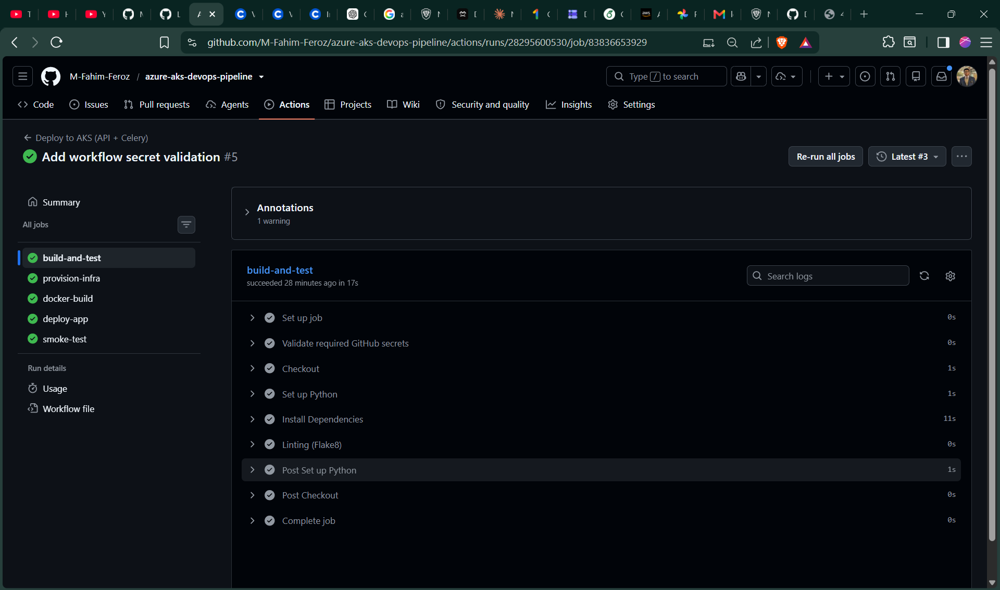

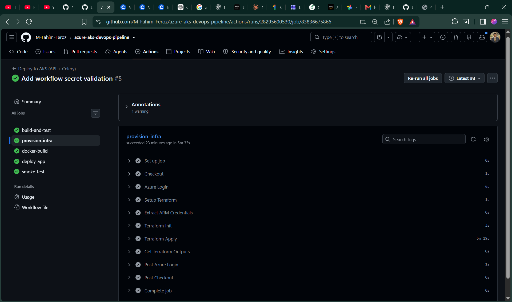

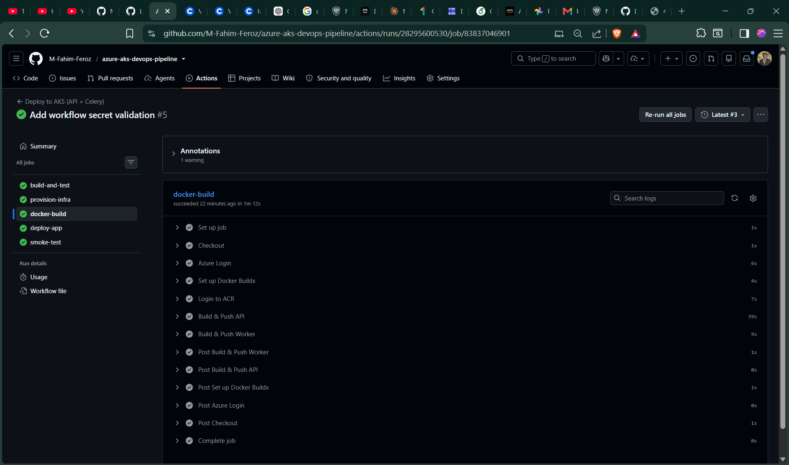

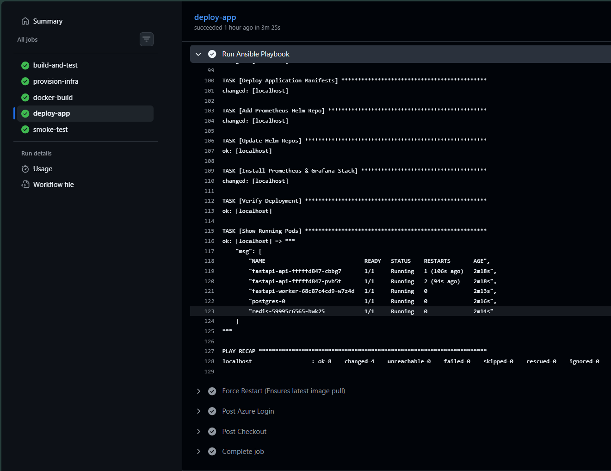

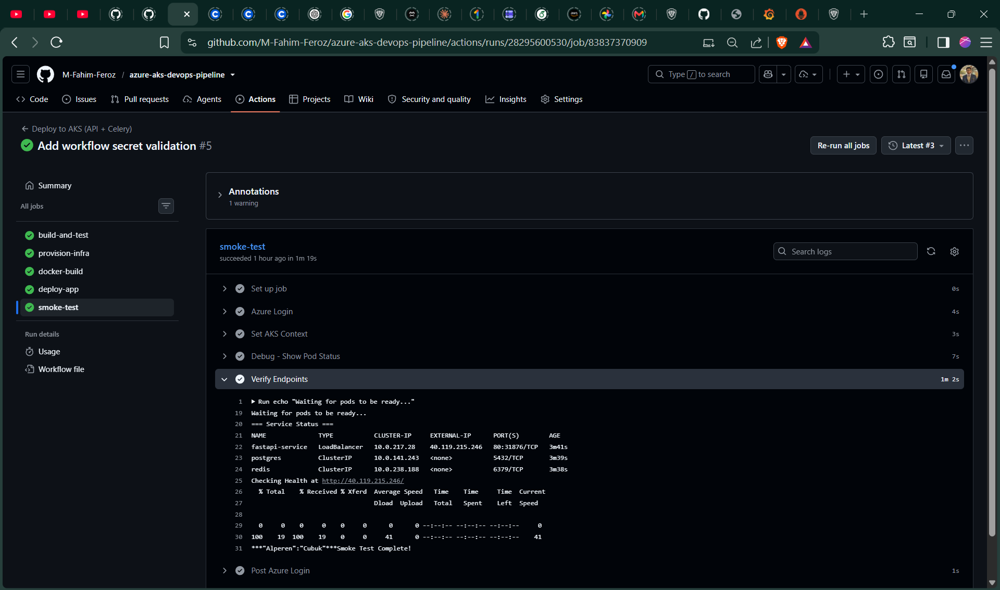

---

### Azure Infrastructure

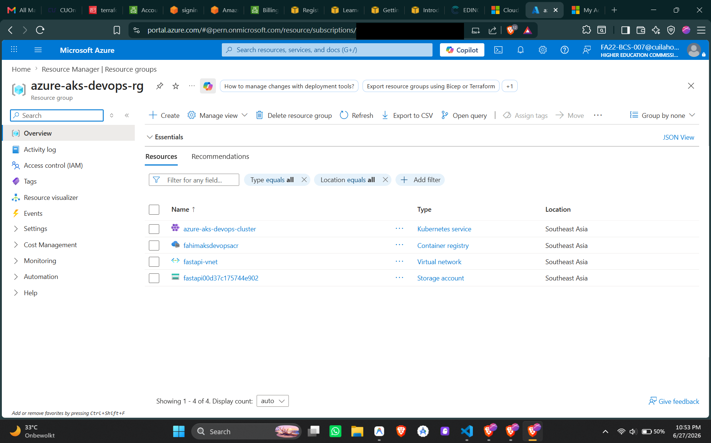

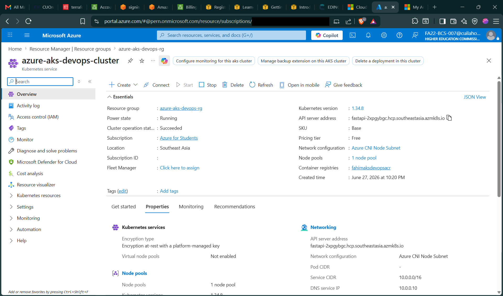

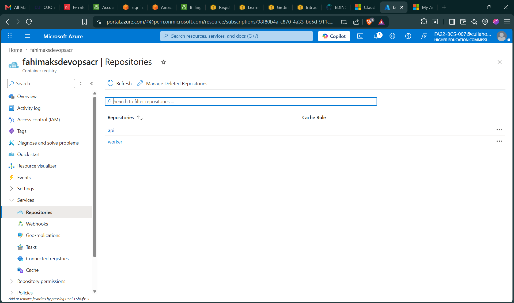

---

### Kubernetes Workloads

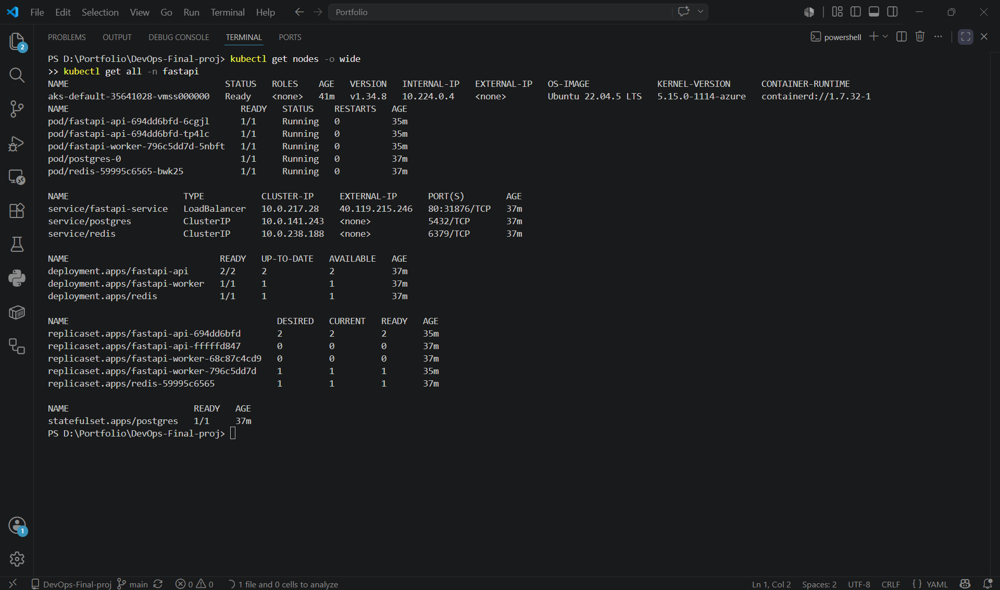

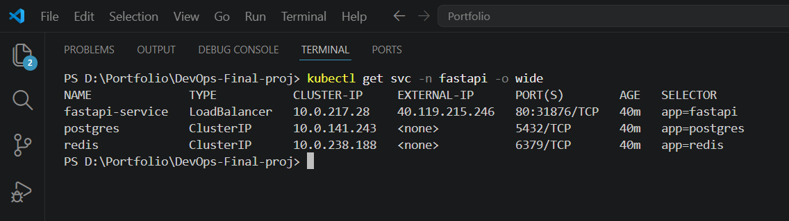

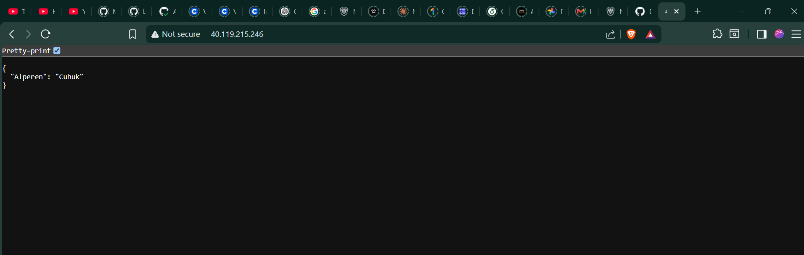

---

### Monitoring and Observability

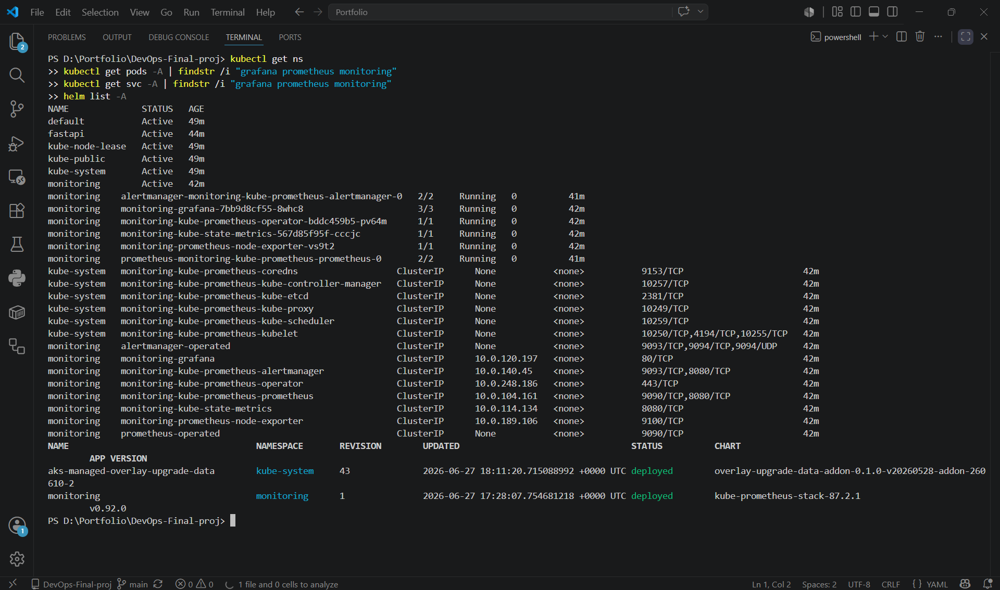

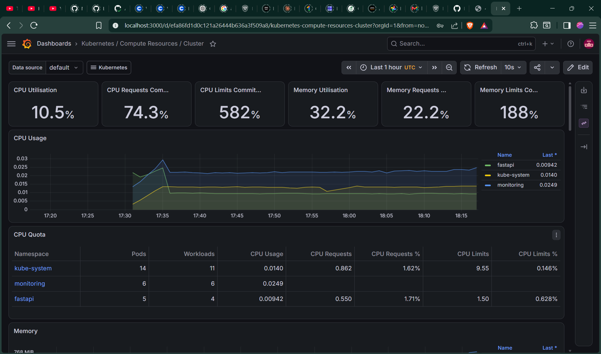

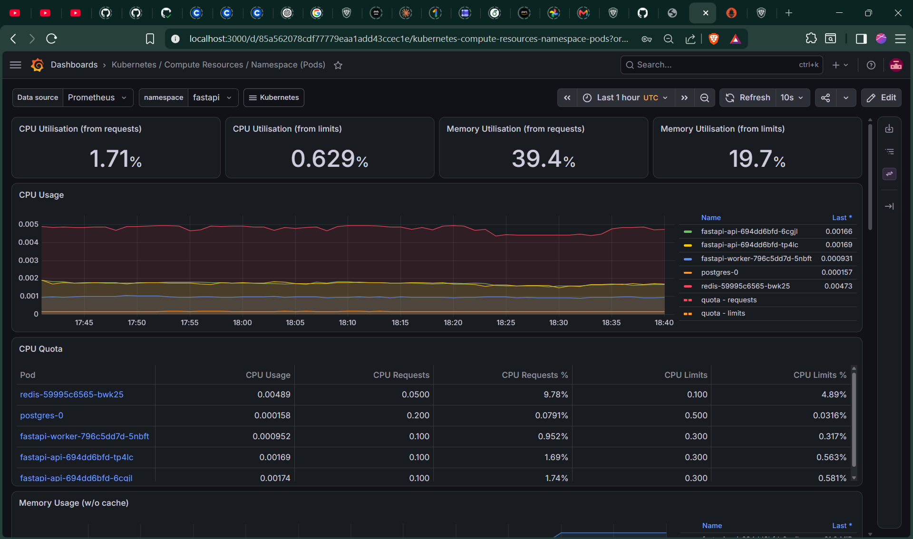

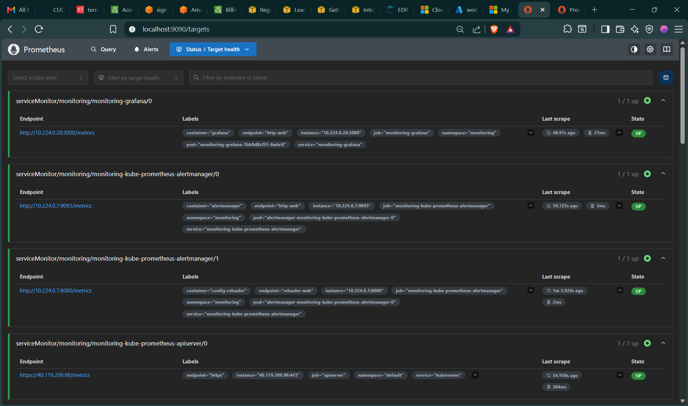

---

## Local Setup

### Required Tools

| Tool | Purpose |
|---|---|
| Azure CLI | Azure authentication and resource management |
| Terraform | Infrastructure provisioning |
| Docker | Container image build and local testing |
| kubectl | Kubernetes cluster management |
| Helm | Monitoring stack installation |
| Python 3.11+ | FastAPI and Celery application |
| Git | Source control |

### Local Development with Docker Compose

```bash
# Start the full stack locally (no Azure required)
docker compose up --build

# Access the API at http://localhost:81
# API docs at http://localhost:81/docs

# Tear down
docker compose down -v
```

---

## Required GitHub Secrets

Configure these secrets in your GitHub repo under **Settings → Secrets and variables → Actions**:

| Secret | Description |
|---|---|
| `AZURE_CREDENTIALS` | Azure Service Principal JSON (clientId, clientSecret, subscriptionId, tenantId) |
| `AZURE_RESOURCE_GROUP` | Azure resource group name |
| `AKS_CLUSTER_NAME` | AKS cluster name |
| `ACR_NAME` | Azure Container Registry name (without `.azurecr.io`) |
| `ACR_LOGIN_SERVER` | ACR login server (e.g. `yourname.azurecr.io`) |
| `POSTGRES_DB` | PostgreSQL database name |
| `POSTGRES_USER` | PostgreSQL username |
| `POSTGRES_PASSWORD` | PostgreSQL password |
| `WEATHER_API_KEY` | Weather API key (use `demo` for testing) |

> Do not commit secret values. Storage account keys are fetched dynamically from Azure during the pipeline run.

---

## Deployment Notes

- Deployed on **Azure for Students** subscription
- Region: **Southeast Asia**
- AKS used a **single demo node** (Standard_DS2_v2)
- Terraform state is managed locally within GitHub Actions (not committed)
- For production use, configure a **remote Terraform backend** (e.g. Azure Storage with state locking)
- This demo uses local Terraform state in GitHub Actions. Failed partial runs may require manual Azure resource group cleanup before re-running: `az group delete --name azure-aks-devops-rg --yes --no-wait`

---

## Cleanup

> [!CAUTION]
> This project provisions real Azure resources (AKS, ACR, LoadBalancers, Storage) which incur cost. Always destroy infrastructure after testing.

```bash
# Delete all Azure resources (recommended)
az group delete --name azure-aks-devops-rg --yes --no-wait
```

---

## Security Notes

- No secrets are committed to this repository
- `terraform.tfstate` is in `.gitignore`
- `terraform.tfvars` is in `.gitignore`
- All credentials are managed through GitHub Actions repository secrets
- Screenshots containing passwords or credentials are not committed (excluded to `docs/screenshots/_excluded/`)
- Azure resources should be destroyed after demo use to avoid exposure of public IPs

---

## Related Portfolio Projects

This project builds on the foundations demonstrated in my other DevOps portfolio repositories:

- [FastAPI DevSecOps Pipeline](https://github.com/M-Fahim-Feroz/fastapi-devsecops-pipeline) — Application containerization, testing, security scanning, and Docker image publishing
- [Kubernetes Application Deployment](https://github.com/M-Fahim-Feroz/kubernetes-application-deployment) — Kubernetes manifests, Helm, probes, resource limits, autoscaling, and CI validation
- [Terraform AWS Infrastructure](https://github.com/M-Fahim-Feroz/terraform-aws-infrastructure) — Infrastructure as Code, secure networking, private compute/database tiers, remote state, and state locking

---

## For Detailed Deployment Steps

See [AZURE_DEPLOYMENT.md](AZURE_DEPLOYMENT.md) for step-by-step Azure setup, service principal creation, and pipeline trigger instructions.
