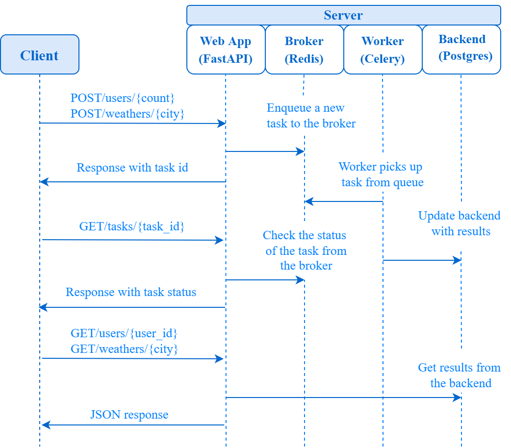

# Azure AKS DevOps Pipeline

A production-style DevOps project that provisions Azure infrastructure, builds and pushes Docker images, deploys a FastAPI microservice stack to AKS, and validates the deployment through an automated GitHub Actions pipeline.

## Overview

This project demonstrates an end-to-end DevOps workflow on Azure Kubernetes Service (AKS). It showcases modern application delivery by integrating infrastructure automation, container orchestration, background task processing, monitoring, and automated CI/CD smoke testing.

## Architecture

* **FastAPI** provides the REST API and Web UI.
* **Celery** worker handles background jobs asynchronously.
* **Redis** is used as the message broker for Celery.
* **PostgreSQL** stores persistent application data.
* **Docker** packages the microservices into consistent containers.
* **Azure Container Registry (ACR)** securely stores the Docker images.
* **Terraform** automatically provisions all necessary Azure infrastructure.
* **Azure Kubernetes Service (AKS)** runs the containerized workloads in the cloud.
* **Ansible** applies the Kubernetes manifests and monitoring stack automation.
* **Prometheus and Grafana** provide observability and metrics.
* **GitHub Actions** orchestrates the entire CI/CD lifecycle.

## Tech Stack

* Python / FastAPI
* Celery
* Redis
* PostgreSQL
* Docker
* Docker Compose
* GitHub Actions
* Terraform
* Azure
* Azure Container Registry (ACR)
* Azure Kubernetes Service (AKS)
* Kubernetes
* Ansible
* Helm
* Prometheus
* Grafana
* Pytest
* Flake8
* Bandit

## Repository Structure

```text
.
├── .github/workflows/      # GitHub Actions CI/CD pipeline
├── ansible/                # Ansible playbooks for K8s & Helm deployments
├── api/                    # FastAPI application code and tests
├── frontend/               # Static Web UI files
├── img/                    # Architecture and validation screenshots
├── infra/                  # Terraform Azure infrastructure code
├── k8s/                    # Kubernetes manifests (Deployments, Services, ConfigMaps)
├── worker/                 # Celery worker code
├── AZURE_DEPLOYMENT.md     # Detailed Azure setup guide
├── devops_report.md        # Technical architecture report
├── docker-compose.yml      # Local development setup
├── README.md               # Project documentation
└── screenshot_instructions.md
```

## CI/CD Pipeline

The `.github/workflows/aks-cicd.yml` workflow orchestrates the following stages on every push to the `main` branch:

1. **Build & Test:** Runs Python linting (`flake8`), security scanning (`bandit`), and unit testing (`pytest`).
2. **Docker Build & Push:** Builds the multi-stage Docker images for the API and Worker, then pushes them to the dynamically provisioned Azure Container Registry.
3. **Infrastructure Provisioning:** Executes `terraform apply` to ensure the Azure Virtual Network, ACR, and AKS cluster are running.
4. **Configuration & Deployment:** Uses Ansible to apply Kubernetes ConfigMaps, Secrets, Deployments, and the Prometheus/Grafana Helm charts.
5. **Force Restart:** Bounces the Kubernetes deployments to ensure the newest ACR images are pulled.
6. **Smoke Test:** Waits for the LoadBalancer IP and executes a live health check `curl` against the public endpoint to validate the rollout.

## Infrastructure Automation

> [!WARNING]
> Terraform state management must be configured before relying on GitHub Actions for repeated apply/destroy operations. For this demo, use a controlled single deployment and verify resources in Azure Portal before cleanup.

Terraform (`infra/`) provisions the following resources in Azure:
* **Resource Group**
* **Virtual Network & Subnets**
* **Azure Container Registry (ACR)**
* **Azure Kubernetes Service (AKS)** cluster
* **Azure Storage Account & File Share** (used for PostgreSQL persistent storage)

## Kubernetes Deployment

The K8s manifests (`k8s/`) handle the deployment of the application components:
* **Deployments:** `fastapi-api` and `fastapi-worker`.
* **StatefulSet:** `postgres` database with a PersistentVolumeClaim mapped to Azure Files.
* **Services:** Internal ClusterIP for Redis/Postgres and a public `LoadBalancer` for the FastAPI UI.
* **ConfigMap & Secret:** Injected dynamically by Ansible and GitHub Actions to keep credentials secure.
* **Probes:** Liveness and Readiness probes ensure traffic only routes to healthy API pods.
* **Resource Limits:** CPU and memory requests/limits are enforced.

## Ansible Automation

Ansible (`ansible/playbook.yaml`) bridges the gap between infrastructure and application by:
* Managing K8s namespaces.
* Applying all Kubernetes manifests idempotently.
* Using the `helm` module to install the `prometheus-community` stack into the cluster.

## Monitoring

Observability is built-in using the kube-prometheus-stack:
* **Prometheus** scrapes the FastAPI `/metrics` endpoint.
* **Grafana** visualizes the data (Accessible via port-forwarding the `monitoring-grafana` service).
* Includes a custom dashboard template (`grafana_template.json`) for tracking API request latency and hardware metrics.

## Security Practices

* **No Secrets Committed:** The `.gitignore` prevents `.env`, `*.tfstate`, and certificates from entering source control.
* **GitHub Actions Secrets:** Cloud credentials are kept entirely within GitHub Secrets.
* **Dynamic K8s Secrets:** Kubernetes Secrets are generated and injected on-the-fly during the CI/CD pipeline using the `azure/k8s-create-secret@v4` action.
* **Code Scanning:** `bandit` is used to detect security vulnerabilities in the Python code during the build phase.

## Required GitHub Secrets

To run the pipeline, the following secrets must be configured in the GitHub repository:

* `AZURE_CREDENTIALS` (Service Principal JSON)
* `ACR_NAME`
* `AZURE_RESOURCE_GROUP`
* `AKS_CLUSTER_NAME`
* `POSTGRES_USER`
* `POSTGRES_PASSWORD`
* `POSTGRES_DB`
* `WEATHER_API_KEY`

*(Note: Storage Account keys are fetched dynamically from Terraform outputs by the pipeline).*

## Local Development

You can run the entire stack locally without Azure using Docker Compose:

```bash
# Start the stack
docker compose up --build

# Access the UI at http://localhost:81/ui

# Tear down the stack and remove volumes
docker compose down -v
```

## Azure Deployment Workflow

For detailed step-by-step instructions on setting up the Azure Service Principal and triggering the pipeline, see [AZURE_DEPLOYMENT.md](AZURE_DEPLOYMENT.md).

## Screenshots / Proof of Work



*(Additional screenshots of Grafana and AKS are captured during active runs).*

## Cost Cleanup

> [!CAUTION]
> This project provisions real Azure resources (AKS, ACR, LoadBalancers) which cost money. **Always destroy the infrastructure after testing to avoid cloud charges.**

```bash
cd infra
terraform destroy
```

## Related Portfolio Projects

This project builds on the foundations demonstrated in my other DevOps portfolio repositories:

* [FastAPI DevSecOps Pipeline](https://github.com/M-Fahim-Feroz/fastapi-devsecops-pipeline) — application containerization, testing, security scanning, and Docker image publishing.
* [Kubernetes Application Deployment](https://github.com/M-Fahim-Feroz/kubernetes-application-deployment) — Kubernetes manifests, Helm, probes, resource limits, autoscaling, and CI validation.
* [Terraform AWS Infrastructure](https://github.com/M-Fahim-Feroz/terraform-aws-infrastructure) — Infrastructure as Code, secure networking, private compute/database tiers, remote state, and state locking.

## Portfolio Scope

This repository focuses on the complete Azure deployment workflow: infrastructure provisioning, container image delivery, Kubernetes deployment automation, monitoring, and post-deployment validation.

