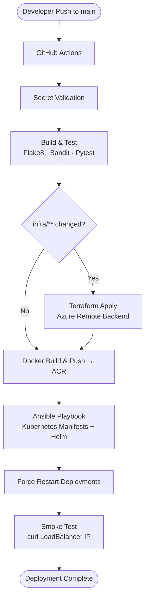
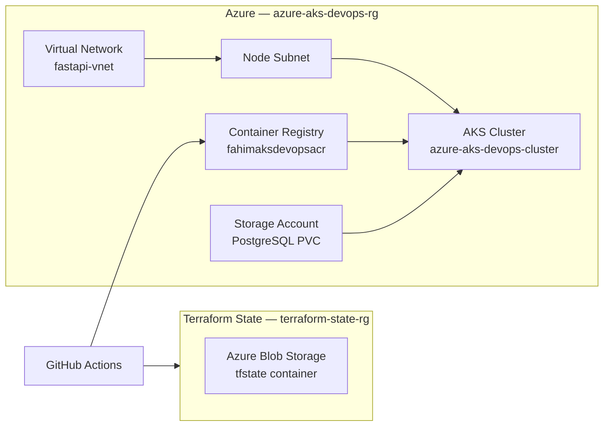
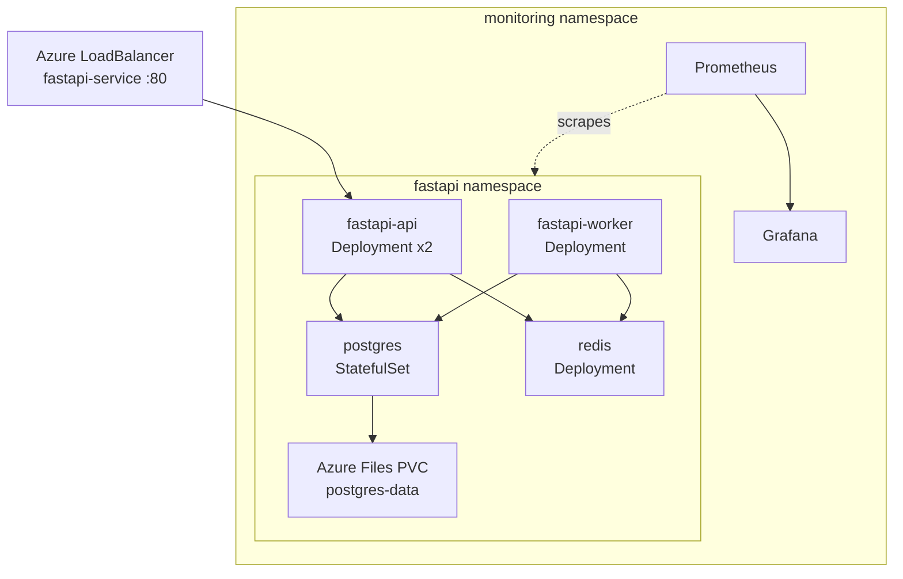

# Architecture — Azure AKS DevOps Pipeline

This document describes the end-to-end architecture of the CI/CD pipeline and deployed infrastructure.

## CI/CD Flow

## Azure Infrastructure

## Kubernetes Workloads

## Back to Main

[← README](../README.md)
